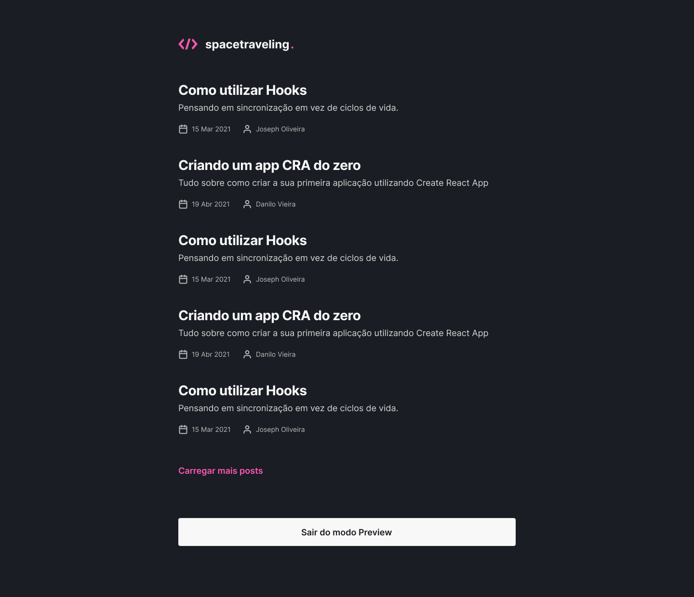

# Spacetraveling




> 🚀 Aplicação desenvolvida no Ignite curso da Rocketseat, desenvolvida em NextJS e as publicações dos posts foi utilizado o Prismic CMS.

## ⚙️ Ajustes e melhorias

O projeto ainda está em desenvolvimento e as próximas atualizações serão voltadas nas seguintes tarefas:

- [x] Criando post com o Prismic CMS e consumindo a API
- [ ] Adicionar featura de poder comentar nos post
- [ ] Adicionar featura de mostrar a data que o post foi editado
- [ ] Responsividade

## 🚀 Tecnologias
[](https://nextjs.org/docs)
[](https://www.typescriptlang.org/docs/)
[](https://sass-lang.com/documentation)

## 💻 Pré-requisitos

Antes de começar, verifique se você atendeu aos seguintes requisitos:
<!---Estes são apenas requisitos de exemplo. Adicionar, duplicar ou remover conforme necessário--->
* Você instalou a versão mais recente de `<GIT / NodeJS / Yarn>`.
* Você tem uma máquina `<Windows / Linux / Mac>`.

## 🚀 Rodando Spacetraveling na sua máquina

Para rodar o Spacetraveling na sua máquina, siga estas etapas:

```
# Clone this repository
$ git clone https://github.com/neanderdev/ignite-desafio-reactjs-criando-uma-aplicacao-do-zero.git

# Go into the repository
$ cd ignite-desafio-reactjs-criando-uma-aplicacao-do-zero

# Install dependencies
$ yarn install
```
Antes de iniciar a aplicação, cria um arquivo na raiz do projeto chamado .env.local e pega o exemplo das váriaveis de ambiente no arquivo .env.example e preencha com as suas informações.

```
# Run the app
$ yarn dev
```

## 📫 Contribuindo para Spacetraveling
<!---Se o seu README for longo ou se você tiver algum processo ou etapas específicas que deseja que os contribuidores sigam, considere a criação de um arquivo CONTRIBUTING.md separado--->
Para contribuir com Spacetraveling, siga estas etapas:

1. Bifurque este repositório.
2. Crie um branch: `git checkout -b <nome_branch>`.
3. Faça suas alterações e confirme-as: `git commit -m '<mensagem_commit>'`
4. Envie para o branch original: `git push origin <nome_do_projeto> / <local>`
5. Crie a solicitação de pull.

Como alternativa, consulte a documentação do GitHub em [como criar uma solicitação pull](https://help.github.com/en/github/collaborating-with-issues-and-pull-requests/creating-a-pull-request).

## 🤝 Colaboradores

Agradecemos às seguintes pessoas que contribuíram para este projeto:

<table>
  <tr>
    <td align="center">
      <a href="#">
        <br>
        <sub>
          <b>Neander de Souza</b>
        </sub>
      </a>
    </td>    
  </tr>
</table>

